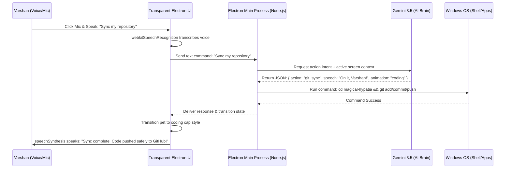

# Pico: Floating Voice-Activated AI Desktop Assistant & Care Pet 🚀

Pico is an ultra-premium, interactive, floating **always-on-top desktop assistant and care pet** that lives right on your Windows taskbar! Powered by **Gemini 3.5**, Pico speaks out loud, listens to your voice commands, monitors your active screen window to keep you focused, and automates native system tasks (launching VS Code, opening study portals, syncing repositories, or playing study music) based on your verbal instructions.

---

## 💎 Premium Features

### 🎙️ 1. High-Fidelity Voice Synthesis & Speech Recognition (TTS / STT)
* **Out-Loud Synthesis (TTS)**: Built using the Chromium `speechSynthesis` engine, synced to high-quality English speech packages. Features a cute, high-pitched adjustments (`1.15x`) to give Pico an energetic, cute, and responsive companion voice.
* **Microphone Capturing (STT)**: Includes a pulsing mic trigger. Clicking it launches `webkitSpeechRecognition`, turning your spoken instructions into text in real time.
* **Animated Mouth Tracking**: Pico's mouth dynamically expands and animates in real time while speaking to simulate physical talking!

### ⚡ 2. Tamagotchi-Style Care Metrics
* Tracks **⚡ Energy**, **💖 Affection**, and **🎓 Intellect** stats in real time.
* Performs actions based on your stats: heavy developer tasks drain Energy, petting Pico (clicking his body) triggers an adorable giggle dialogue and boosts Affection, and studying or syncing code grows Intellect!
* All metrics are fully saved in **localStorage** and persist across system restarts.

### 🎯 3. Focus Pomodoro Clock & Screen Slack Alerts
* Tell Pico to *"start a 25 minute study clock"* to trigger a glowing Pomodoro overlay.
* Pico runs an ultra-fast background **PowerShell Win32 active window scanner** that monitors your foreground window title.
* If you wander off onto distracting websites or games (Twitter, Discord, steam) during a study session, Pico will **speak out loud in a strict but playful tone**: *"Hey Varshan! Let's get back to work! Studying mode is active! 📚"*

### 💫 4. Spring-Damping Gravity Drag Physics
* Click and hold the top handle or Pico's body, drag him anywhere on your screen, and let go.
* Pico **falls back down to earth**, smoothly sliding and landing safely in his cozy home right above your Windows taskbar, driven by a responsive spring-damping gravity physics simulation.

### 🎛️ 5. Glassmorphic Collapsible Dashboard Panel
* Double-clicking the pet container collapses the window to **Compact Mode (180px)**, hiding the sidebar and leaving only your cute pet visible!
* Double-clicking again expands it to **Expanded Dashboard Mode (420px)** to adjust voice settings, view care metrics, or type commands.

---

## 🛠️ System Architecture

Pico is engineered purely on lightweight native web standards to avoid bulky, heavy, or unreliable compiled Node modules.



---

## 🚀 Setup & Installation

### 1. Prerequisites
Ensure you have [Node.js](https://nodejs.org/) installed on your Windows system.

### 2. Clone the Repository
```powershell
git clone https://github.com/VARSHAN69/desktop-ai-companion.git
cd desktop-ai-companion
```

### 3. Install Dependencies
```powershell
npm install
```

### 4. Configure Secure Credentials
Create a `.env` file in the root of the project to securely house your Gemini API Key (**this file is automatically gitignored and will never be pushed to GitHub!**):
```env
# Get a free Gemini API key from https://aistudio.google.com/
GEMINI_API_KEY=your_gemini_api_key_here
```

### 5. Launch Pico
```powershell
npm start
```

---

## 🎮 How to Interact with Pico

* **Pet Pico**: Click on his body to trigger a happy jump animation, hear him giggle out loud, and boost his Affection stat!
* **Toggle Dashboard**: Double-click on the pet container to slide the sidebar in or out.
* **Reposition**: Drag Pico anywhere on your monitors and release to watch him fall smoothly back down to the taskbar.
* **Study Time**: Click the mic and speak: *"Hey Pico, start a 20 minute study block and open LeetCode"* or *"Launch VS Code and play study music"*.
* **Sync Repositories**: Speak: *"Sync my code"* to let Pico automatically commit and push your active work!
